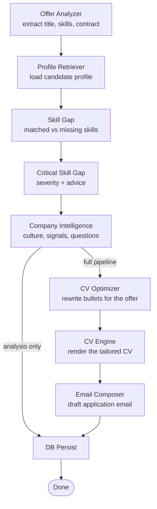
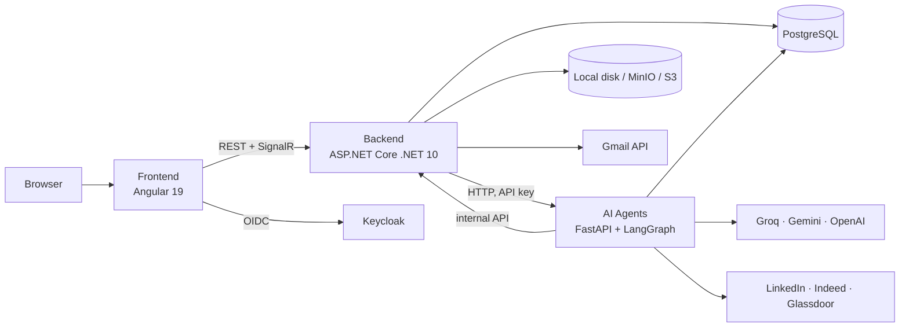

# NextStep

**An AI job-application copilot.** NextStep covers the whole job hunt in one place: it finds offers, analyzes them against your profile, rebuilds your CV for each role, writes and sends the application from your own Gmail, follows the recruiter's replies, and prepares you for the interview.

```
Find offers ──► Analyze & match ──► Tailored CV ──► Email via Gmail ──► Track replies ──► Interview prep
```

---

## Table of contents

1. [Why NextStep](#why-nextstep)
2. [Features](#features)
3. [The AI pipeline](#the-ai-pipeline)
4. [Architecture](#architecture)
5. [Tech stack](#tech-stack)
6. [Repository structure](#repository-structure)
7. [Getting started](#getting-started)
8. [Environment variables](#environment-variables)
9. [Useful commands](#useful-commands)
10. [CI/CD and deployment](#cicd-and-deployment)
11. [API overview](#api-overview)
12. [Troubleshooting](#troubleshooting)

---

## Why NextStep

Applying for jobs is repetitive work spread across many tools: job boards in one tab, a CV in Word, emails in Gmail, a spreadsheet to keep track. NextStep replaces that with a single workflow.

| Without NextStep | With NextStep |
|---|---|
| Searching LinkedIn, Indeed and Glassdoor separately | One feed of offers from all three, with duplicates removed |
| Guessing whether your CV fits the offer | A match score, the ATS keywords you cover and the skills you're missing |
| One generic CV sent everywhere | A CV rewritten for each offer, exported to PDF from professional templates |
| Writing each cover email by hand | An AI-drafted email sent from **your own** Gmail with the CV attached |
| Checking your inbox to see who answered | Recruiter replies read and classified automatically (interview, rejection, pending) |
| Forgetting to follow up | Follow-up reminders detected by a daily background job |
| Preparing for interviews alone | A mock interviewer, a salary coach and a research brief on the company |

### Highlights

- **End-to-end pipeline, not isolated tools.** One offer goes through analysis, skill-gap detection, company research, CV generation and the email draft in a single LangGraph workflow.
- **Live progress.** Each pipeline step is pushed to the browser in real time over SignalR.
- **Your data, your inbox.** Applications are sent through your Gmail account over OAuth2, so replies land in your normal inbox.
- **Several LLM providers.** Groq, Gemini and OpenAI are supported and tried in a configurable priority order (`LLM_PROVIDER_PRIORITY`). If one is down or rate-limited, the next one is used.
- **Modular monolith backend.** Each business domain (Profile, Sourcing, Applications, CV documents, Messaging, Coaching) is a separate module with its own API, domain, infrastructure and database context.
- **Ready to deploy.** Docker Compose for local and production use, Terraform for AWS (a single-EC2 demo, or ECS Fargate with RDS Multi-AZ), and GitHub Actions for CI and deployment.

---

## Features

### 1. Candidate profile
- Guided **onboarding** for new users.
- Profile sections: personal info, experience, projects, skills, education, certifications, languages.
- **CV import**: upload an existing CV and let the AI parse it into the profile.
- **LinkedIn import**.
- JSON export of the profile.

### 2. Job sourcing (`/offers-recent`)
- Scrapes **LinkedIn, Indeed and Glassdoor** (with [Scrapling](https://github.com/D4Vinci/Scrapling)).
- Filters: keywords, location, posting date, contract type, source.
- Workflow states: **saved**, **shortlisted**, **archived**.
- **Promote** a scraped offer into the analysis pipeline with one click.

### 3. Offer analysis and matching (`/offers`)
- Submit an offer as a **URL or pasted text**.
- Extracts title, company, required skills, contract, location and salary.
- Computes a **match score** and an **ATS compatibility** score against your profile.
- **Skill gap** (`/skill-gap`): skills you have vs. skills you're missing, how critical the gap is, and advice on closing it.
- Previous analyses can be reopened from the history.

### 4. Company intelligence (`/company-intel`)
- A research brief on the company: culture, business signals, what they expect from candidates, and likely interview questions.

### 5. CV builder (`/cv`)
- Bullet points rewritten to match the offer's keywords and put measurable impact first.
- Templates: **Modern, Tech LaTeX, Executive, Elegant, Horizon**.
- Live HTML preview and PDF export (QuestPDF / Puppeteer).
- History of every generated CV, with download and delete.
- Files stored on local disk by default, or on MinIO / S3.

### 6. Emails and letters (`/letters`)
- AI drafts for the **application email**, **follow-ups** and **replies**.
- One workspace per application with drafts, sent messages and history.
- **Gmail OAuth2** connection (`/email/settings`) so emails are sent from your own address.
- Sent with or without the tailored CV attached.

### 7. Application tracking (`/applications`)
- Every application with its status, notes and timeline.
- **Recruiter reply tracking**: Gmail threads are polled and each reply is classified (interview, rejection, pending, etc.), which updates the application status.
- **Follow-up detection**: flags applications that need a reminder.
- Both run as scheduled **Hangfire** jobs: `check-email-replies` and `detect-follow-up-needed`.

### 8. Career coaching (`/chatbot`)
- **Interview simulator**: technical and behavioral questions for the target role, with feedback on each answer.
- **Salary coach**: pay benchmarks and negotiation talking points.
- **Arena**: interactive practice sessions.

### 9. SN Copilot (Smart Navigator)
- An AI assistant in a side drawer, available from every page.
- Knows your profile and your applications: it can list recent applications, change their status, add notes, create new ones, show stats and list pending follow-ups, all in plain language.

### 10. Dashboard and notifications
- KPIs: applications, statuses, success rate, CVs generated.
- Recently scraped offers, recent activity and applications.
- In-app notification center.

### 11. Public landing page (`/`)
- A marketing page that presents the product: interactive hero, the 5-step pipeline, and an ATS simulator demo. Visitors can see it without logging in.

---

## The AI pipeline

The core of NextStep is a **LangGraph** workflow in [agents/app/domain/pipeline/workflow.py](agents/app/domain/pipeline/workflow.py). Each node is a specialized agent.



- **Offer Analyzer** and **CV Optimizer** each have a **validator** step. If the output fails validation, the step runs again.
- With `only_analysis`, the pipeline stops after company research. This gives a quick "should I apply?" check without generating documents.
- The backend relays progress to the frontend through the SignalR hub at `/hubs/pipeline`.

### The user journey

In the UI the pipeline is shown as five steps: **Offer → Skill Gap → Template → Final CV → Email & Send**.

1. Complete your profile, or import your CV or LinkedIn.
2. Source an offer from the job boards, or paste one in.
3. The pipeline analyzes it and scores the match.
4. Review the skill gap and pick a CV template.
5. Generate the tailored CV.
6. Generate the email and send it from your Gmail.
7. NextStep tracks the recruiter's reply and updates the application.
8. Prepare with the interview simulator, the salary coach and company intel.

---

## Architecture



| Service | Role |
|---|---|
| **frontend** | Angular 19 standalone app, lazy-loaded routes, Keycloak auth, SignalR client |
| **backend** | Business API, persistence (EF Core), orchestration, PDF rendering, Gmail, Hangfire jobs, SignalR hub |
| **agents** | FastAPI service that hosts the LangGraph agents, the job-board scrapers and resume parsing |
| **keycloak** | Identity provider (login, sign-up, Google login, custom theme) |
| **db** | PostgreSQL for the app data, the agents and Hangfire |
| **minio** | Optional S3-compatible object storage (`--profile minio`) |
| **nginx** | Production reverse proxy (`/api`, `/hubs`, `/agents`, `/auth`, `/`) |

### Backend modules

Every module in [backend/Modules/](backend/Modules/) has the same layers: `Api/`, `Application/`, `Domain/`, `Infrastructure/`, plus a `*Module.cs` that registers it.

| Module | Responsibility |
|---|---|
| `Profile` | Candidate profile, identity, onboarding |
| `Sourcing` | Scraped offers, offer analysis |
| `Applications` | Applications (candidatures), statuses, follow-ups |
| `CvDocuments` | CV templates, generation, PDF rendering, history |
| `Messaging` | Emails, Gmail OAuth connections, reply classification jobs |
| `Coaching` | Interview arena, chatbot, SN Copilot bridge |

[backend/Shared/](backend/Shared/) contains cross-cutting code: error handling, the agent HTTP client, persistence helpers, pagination, storage (local or MinIO) and the SignalR hub.

### AI agent domains

Found in [agents/app/domain/](agents/app/domain/):

| Domain | What it does |
|---|---|
| `pipeline` | The main LangGraph workflow described above |
| `offer_analyzer` | Structured extraction from offers, with a validator |
| `profile_retriever` | Loads and summarizes the candidate profile |
| `matching` | Skill matching and scoring |
| `company` | Company intelligence (uses web search) |
| `cv_optimizer` | Rewrites the CV for the offer, with a validator |
| `cv_engine` | Builds the final CV document payload |
| `email_composer` | Application, follow-up and reply emails; reply classification |
| `job_boards` | LinkedIn, Indeed and Glassdoor scrapers |
| `resume` | CV and LinkedIn parsing, profile summaries |
| `chatbot` | Interview, salary coach and career chat |
| `sn_copilot` | SN Copilot assistant with profile and application tools |

---

## Tech stack

| Layer | Technologies |
|---|---|
| Frontend | Angular 19, TypeScript 5.7, TailwindCSS 3.4, SCSS, RxJS, SignalR, keycloak-angular, Vitest |
| Backend | ASP.NET Core (.NET 10), EF Core + Npgsql, Hangfire, QuestPDF, PuppeteerSharp, Fluid templates, AWS SDK S3, Swagger |
| AI | Python, FastAPI, LangChain, LangGraph, Groq / Gemini / OpenAI, Scrapling, SQLAlchemy (async), Tavily search |
| Data and infra | PostgreSQL, MinIO, Keycloak, Nginx, Docker Compose, Terraform (AWS ECS Fargate / EC2, RDS, KMS) |
| Quality | GitHub Actions, Ruff, pytest, Vitest, xUnit, SonarQube, Codecov |

---

## Repository structure

```text
Next-Step-v2/
├─ frontend/                    # Angular app
│  ├─ public/                   # static assets (landing images, logos, silent-check-sso.html)
│  └─ src/app/
│     ├─ core/                  # auth, guards, http, i18n, layout, notifications
│     └─ features/              # one folder per feature (lazy-loaded)
│        ├─ landing/            # public landing page
│        ├─ signup/  onboarding/  profile/  dashboard/
│        ├─ offers/             # analysis pipeline, sourced offers
│        ├─ skill-gap/  company-intel/  cv-builder/
│        ├─ applications/       # applications, letters, email workspace
│        ├─ chatbot/            # interview, salary coach, arena
│        ├─ sn-copilot/         # SN Copilot drawer
│        ├─ notifications/  settings/
│
├─ backend/                     # ASP.NET Core API (modular monolith)
│  ├─ Modules/                  # Profile, Sourcing, Applications, CvDocuments, Messaging, Coaching
│  ├─ Shared/                   # cross-cutting code (errors, http, persistence, storage, realtime)
│  ├─ thumbnails/               # CV template previews
│  ├─ tests/                    # backend tests
│  └─ Program.cs
│
├─ agents/                      # FastAPI + LangGraph AI service
│  ├─ app/api/                  # HTTP routers
│  ├─ app/core/                 # config, LLM factory, DB, backend client
│  ├─ app/domain/               # one folder per agent domain
│  ├─ tests/
│  └─ main.py
│
├─ init_config/
│  ├─ postgres/                 # DB init scripts and seeds
│  ├─ keycloak/                 # realm import and custom themes
│  └─ nginx/                    # production reverse proxy
├─ infra/aws/
│  ├─ ec2-quickstart/           # 1 EC2 + docker-compose.prod.yml + HTTPS (demo)
│  └─ enterprise-fargate/       # ECS Fargate, ALB, RDS Multi-AZ, KMS (production)
├─ scripts/                     # dev.ps1 (local stack without Docker), Keycloak secrets
├─ docs/                        # architecture diagrams, module docs, use-case diagram
├─ .github/workflows/           # ci.yml, deploy-ec2.yml, deploy-fargate.yml
├─ docker-compose.yml           # shared base (services, healthchecks, volumes)
├─ docker-compose.dev.yml       # dev overrides (ports, hot reload)
├─ docker-compose.prod.yml      # prod overrides (nginx, restart policies, limits)
└─ NextStep.sln
```

More detail in [docs/](docs/): [backend-modules.md](docs/backend-modules.md), [backend-diagrams.md](docs/backend-diagrams.md), [frontend-structure.md](docs/frontend-structure.md).

---

## Getting started

### Option A: Docker Compose (recommended)

Prerequisite: Docker with Docker Compose.

```bash
cp .env.example .env          # then fill in your API keys and secrets
docker compose -f docker-compose.yml -f docker-compose.dev.yml up --build
```

The first build is slow. After that, `up` alone is enough: backend, agents and frontend code is mounted and hot-reloaded. You only need `--build` again after changing a `Dockerfile`, `requirements.txt`, `package.json` or `NextStep.csproj`.

| Service | URL |
|---|---|
| Frontend (landing page) | http://localhost:4200 |
| Backend API / Swagger | http://localhost:5000/swagger |
| Hangfire dashboard | http://localhost:5000/hangfire |
| Agents API docs | http://localhost:8000/docs |
| Keycloak | http://localhost:8080 |
| PostgreSQL | localhost:5433 |

**Production** (only nginx is exposed, on `HTTP_PORT`, default 80):

```bash
docker compose -f docker-compose.yml -f docker-compose.prod.yml up -d --build
```

Set `PUBLIC_URL` in `.env`. Files are stored on local disk by default (`STORAGE_MODE=Local`). To use MinIO, add `--profile minio`.

### Option B: run each service manually

```bash
# Frontend
cd frontend && npm install && npm start

# Backend
cd backend && dotnet restore && dotnet run

# Agents
cd agents && pip install -r requirements.txt
uvicorn main:app --host 0.0.0.0 --port 8000 --reload
```

On Windows, [scripts/dev.ps1](scripts/dev.ps1) starts the local stack without Docker.

---

## Environment variables

The full list is in [.env.example](.env.example). The most important ones:

| Group | Variables |
|---|---|
| Database | `POSTGRES_*`, `ConnectionStrings__DefaultConnection`, `DATABASE_URL` |
| Auth | `KEYCLOAK_*`, `Keycloak__ClientSecret` |
| LLMs | `GROQ_API_KEY`, `GEMINI_API_KEY`, `OPENAI_API_KEY`, `LLM_PROVIDER_PRIORITY` (e.g. `groq,gemini,openai`) |
| Gmail | Google OAuth client ID/secret and callback URL |
| Storage | `STORAGE_MODE`, `MINIO_*` |
| Search | `TAVILY_API_KEY` |
| Production | `PUBLIC_URL`, `HTTP_PORT` |

---

## Useful commands

| Area | Command |
|---|---|
| Frontend dev server | `cd frontend && npm start` |
| Frontend build | `cd frontend && npm run build` |
| Frontend tests | `cd frontend && npm test` |
| Backend build | `dotnet build` |
| Backend tests | `dotnet test backend/tests/NextStep.Tests.csproj` |
| Agents tests | `cd agents && pytest` |
| Agents lint | `cd agents && ruff check .` |

---

## CI/CD and deployment

| Workflow | Trigger | What it does |
|---|---|---|
| [ci.yml](.github/workflows/ci.yml) | Push / PR | Agents: Ruff lint, import checks, unit and FastAPI integration tests, coverage to Codecov. Frontend: install and TypeScript type check. SonarQube analysis. |
| [deploy-ec2.yml](.github/workflows/deploy-ec2.yml) | Push | Deploys to the EC2 quickstart through AWS SSM (OIDC credentials, no stored keys) |
| [deploy-fargate.yml](.github/workflows/deploy-fargate.yml) | Manual | Deploys to ECS Fargate (staging / production) |

The Terraform code is in [infra/aws/](infra/aws/). See [infra/aws/README.md](infra/aws/README.md) for both deployment targets.

---

## API overview

### Backend (`http://localhost:5000`)

| Route | Module |
|---|---|
| `api/profile`, `api/identity` | Profile |
| `api/offers`, `api/sourced-offers` | Sourcing |
| `api/candidatures` | Applications |
| `api/cv` | CvDocuments |
| `api/emails`, `api/email-connections` | Messaging |
| `api/arena`, `api/sn`, `api/agents` | Coaching |
| `internal/agents/*` | Internal endpoints called by the agents (API key protected) |
| `/hubs/pipeline` | SignalR hub for live pipeline progress |

### Agents (`http://localhost:8000/docs`)

| Route | Purpose |
|---|---|
| `/offer/*` | Full pipeline, offer analysis, matching |
| `/company/*` | Company intelligence |
| `/cv-engine/*`, `/cv-optimizer/*` | CV generation and optimization |
| `/email/*` | Generate, follow-up, reply, classify |
| `/linkedin-jobs/*`, `/indeed-jobs/*`, `/glassdoor-jobs/*` | Job-board scraping |
| `/resume/*` | CV and LinkedIn parsing |
| `/api/chatbot/*` | Interview, salary coach, career chat |
| `/api/agents/sn/*` | SN Copilot |

---

## Troubleshooting

**Gmail OAuth fails (redirect mismatch / access denied)**
- The `redirect_uri` must match the one in Google Cloud Console exactly.
- If the Google app is in testing mode, add your account as a test user.
- Check that the credentials were saved through `api/email-connections`.

**Email sent without the CV attached**
- Make sure the final CV was saved (`api/cv/save`, or check the CV history).
- Make sure the CV ID used for sending is the latest generated CV.

**Pipeline stuck on "Saving..."**
- Check the backend logs (PDF renderer, SignalR, `/offers/*` endpoints).
- Check file storage (the `backend_storage` volume, or MinIO) and the database.
- Look for timeouts or `500` errors in the browser's network tab.

**Scraped offer doesn't open the analysis screen**
- The expected flow is `/offers-recent` → `/offers/analyze?offerId=...`.
- The offer must be promoted first (`/api/sourced-offers/{id}/promote`).

**Landing page redirects straight to login**
- Keycloak must be initialized with `onLoad: 'check-sso'` in [frontend/src/app/app.config.ts](frontend/src/app/app.config.ts). Private pages are protected by `authGuard` instead.
