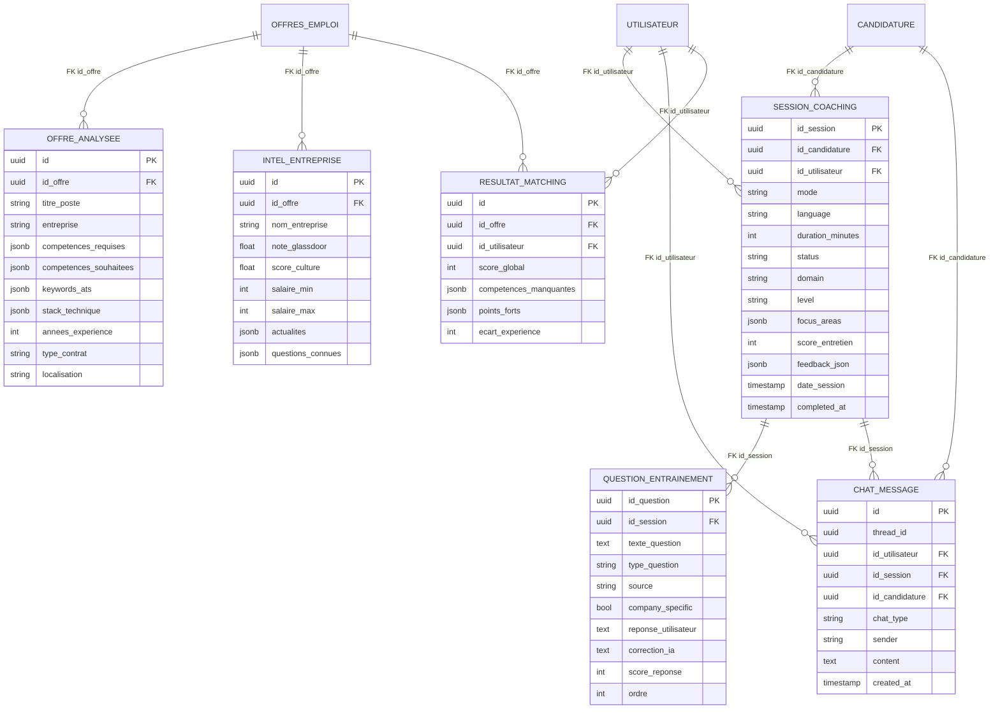

# Backend Database Schema And Class Diagram

Ce document se base sur le backend .NET actuel et distingue deux couches de donnees :

1. le schema principal pilote par `AppDbContext`
2. les tables annexes partagees avec le module chatbot / les agents Python

Note importante :
- plusieurs relations vers `utilisateur` sont logiques au niveau applicatif mais ne sont pas forcees par une cle etrangere SQL dans le schema principal
- `cv_history.template_slug -> cv_template.slug` est aussi une relation logique, pas une FK SQL
- `sourced_offer.promoted_offer_id -> offres_emploi.id` est une relation logique, pas une FK SQL
- le module chatbot garde encore une reference legacy a `public.offre` dans `ArenaService`, alors que le coeur backend persiste les offres dans `public.offres_emploi`

## 1. Core backend schema (.NET / EF Core)

```mermaid
erDiagram
    UTILISATEUR {
        uuid id_utilisateur PK
        string keycloak_id
        string email
        string nom
        string prenom
        string titre_poste
        jsonb onboarding_data
        bool onboarding_completed
        int profile_score
        timestamp date_inscription
    }

    EXPERIENCE {
        uuid id_experience PK
        uuid id_utilisateur
        string entreprise
        string poste
        timestamp date_debut
        timestamp date_fin
        string type_contrat
        jsonb taches
        bool is_valid
    }

    FORMATION {
        uuid id_formation PK
        uuid id_utilisateur
        string etablissement
        string diplome
        int annee
        int annee_fin
        string specialisation
    }

    PROJET {
        uuid id_projet PK
        uuid id_utilisateur
        string titre_projet
        string technologies_utilisees
        string lien_projet
        jsonb taches
        bool is_university
        bool is_valid
    }

    COMPETENCE {
        uuid id_competence PK
        uuid id_utilisateur
        string nom
        int niveau
        string type_competence
        bool is_valid
    }

    CERTIFICATION {
        uuid id_certification PK
        uuid id_utilisateur
        string titre
        string organisation
        timestamp date_obtention
        string id_credential
        string url_credential
    }

    SKILL_KEYWORD {
        uuid id_skill_keyword PK
        string mot
        string categorie
    }

    OFFRES_EMPLOI {
        uuid id PK
        uuid utilisateur_id
        text texte_brut
        jsonb analyse_json
        timestamp date_creation
    }

    CANDIDATURE {
        uuid id_candidature PK
        uuid id_utilisateur
        uuid id_offre FK
        timestamp date_creation
        string statut
        string response_status
        bool has_response
        bool follow_up_needed
        timestamp last_follow_up_at_utc
    }

    DOCUMENT_GENERE {
        uuid id_document PK
        uuid id_candidature FK
        jsonb cv_contenu_ia_json
        text lettre_motiv_contenu_ia
        string chemin_pdf_cv
        string chemin_pdf_lettre
        int version
        timestamp date_generation
    }

    EMAIL_DRAFT {
        uuid id_email_draft PK
        uuid id_candidature FK
        string type_email
        string recipient_email
        string objet
        text corps
        bool est_approuve
        bool est_envoye
        string provider_message_id
        string provider_thread_id
        int nb_tentatives_envoi
    }

    USER_EMAIL_CONNECTION {
        uuid id PK
        uuid id_utilisateur
        string provider
        string adresse_email
        text access_token_chiffre
        text refresh_token_chiffre
        timestamp access_token_expire_utc
    }

    USER_OAUTH_CREDENTIAL {
        uuid id PK
        uuid id_utilisateur
        string provider
        text client_id_chiffre
        text client_secret_chiffre
        string redirect_uri_override
    }

    OAUTH_STATE {
        uuid id PK
        uuid id_utilisateur
        string provider
        string state_token_hash
        timestamp expire_utc
        bool utilise
        timestamp date_utilisation
    }

    CV_TEMPLATE {
        uuid id PK
        string slug
        string name
        string style
        int layout
        jsonb industries
        jsonb experience_levels
        jsonb tags
        bool is_active
    }

    CV_HISTORY {
        uuid id PK
        uuid user_id
        string title
        string template_slug
        jsonb cv_data_json
        jsonb design_config_json
        text html_snapshot
        string file_url
        string object_key
        string bucket_name
        bigint file_size_bytes
    }

    SOURCED_OFFER {
        uuid id PK
        uuid user_id
        string provider
        string provider_job_id
        string title
        string company
        string location
        text description
        string dedupe_key
        bool is_saved
        bool is_shortlisted
        bool is_archived
        uuid promoted_offer_id
    }

    SCRAPE_SESSION {
        uuid id PK
        uuid user_id
        string keywords
        string location
        jsonb providers_json
        jsonb contract_types_json
        int limit_value
        int result_count
        jsonb warnings_json
        jsonb errors_json
        timestamp created_at_utc
    }

    UTILISATEUR ||--o{ EXPERIENCE : "logical via id_utilisateur"
    UTILISATEUR ||--o{ FORMATION : "logical via id_utilisateur"
    UTILISATEUR ||--o{ PROJET : "logical via id_utilisateur"
    UTILISATEUR ||--o{ COMPETENCE : "logical via id_utilisateur"
    UTILISATEUR ||--o{ CERTIFICATION : "logical via id_utilisateur"
    UTILISATEUR ||--o{ OFFRES_EMPLOI : "logical via utilisateur_id"
    OFFRES_EMPLOI ||--o{ CANDIDATURE : "FK id_offre"
    CANDIDATURE ||--|| DOCUMENT_GENERE : "unique FK id_candidature"
    CANDIDATURE ||--o{ EMAIL_DRAFT : "FK id_candidature"
    UTILISATEUR ||--o{ USER_EMAIL_CONNECTION : "logical via id_utilisateur"
    UTILISATEUR ||--o{ USER_OAUTH_CREDENTIAL : "logical via id_utilisateur"
    UTILISATEUR ||--o{ OAUTH_STATE : "logical via id_utilisateur"
    UTILISATEUR ||--o{ CV_HISTORY : "logical via user_id"
    CV_TEMPLATE ||--o{ CV_HISTORY : "logical via template_slug"
    UTILISATEUR ||--o{ SOURCED_OFFER : "logical via user_id"
    UTILISATEUR ||--o{ SCRAPE_SESSION : "logical via user_id"
    OFFRES_EMPLOI ||--o{ SOURCED_OFFER : "logical via promoted_offer_id"
```

## 2. Shared chatbot / agents tables

Ces tables existent dans les modeles ou dans `deploy/postgres/init.sql` et sont utilisees par `ArenaService` et les agents Python.

## 3. Backend class diagram

Le diagramme ci-dessous est volontairement architectural : controllers, services, repositories, infra et integrations. Les entites metier sont deja decrites dans les ER diagrams.

```mermaid
classDiagram
    direction LR

    class Program
    class DependencyInjection
    class AppDbContext
    class DatabaseInitializer
    class PipelineHub

    class OfferController
    class ProfileController
    class CvController
    class EmailController
    class EmailConnectionsController
    class CandidatureController
    class IdentityController
    class ArenaController
    class SourcedOffersController

    class IOfferService
    class OfferService
    class IPipelineRunnerService
    class PipelineRunnerService
    class IPdfGenerationService
    class PdfGenerationService
    class IOfferRepository
    class OfferRepository

    class IProfileService
    class ProfileService
    class IUserService
    class UserService
    class IUserRepository
    class UserRepository

    class ICvService
    class CvService
    class ICvTemplateService
    class CvTemplateService
    class ITemplateThumbnailService
    class TemplateThumbnailService
    class ICvHtmlTemplateRenderer
    class CvHtmlTemplateRenderer
    class ICvPdfRenderer
    class CvPdfRenderer
    class IStorageService
    class MinioStorageService

    class ICandidatureService
    class CandidatureService
    class ICandidatureRepository
    class CandidatureRepository

    class IEmailService
    class EmailService
    class IEmailConnectionService
    class EmailConnectionService
    class IEmailSenderService
    class GmailEmailSenderService
    class IGmailReplyMonitorService
    class GmailReplyMonitorService
    class IResponseClassificationService
    class ResponseClassificationService
    class IEmailDraftRepository
    class EmailDraftRepository
    class IUserEmailConnectionRepository
    class UserEmailConnectionRepository
    class IUserOAuthCredentialRepository
    class UserOAuthCredentialRepository
    class IOAuthStateRepository
    class OAuthStateRepository

    class IArenaService
    class ArenaService
    class ChatbotIAgentHttpClient
    class ChatbotAgentHttpClient

    class ISourcedOfferService
    class SourcedOfferService

    class SharedIAgentHttpClient
    class SharedAgentHttpClient

    class CheckEmailRepliesJob
    class DetectFollowUpNeededJob

    Program --> DependencyInjection
    Program --> DatabaseInitializer
    DependencyInjection --> AppDbContext
    DatabaseInitializer --> AppDbContext
    DatabaseInitializer --> IStorageService
    DatabaseInitializer --> ITemplateThumbnailService

    OfferController --> IOfferService
    OfferController --> IPipelineRunnerService
    OfferController --> IPdfGenerationService
    OfferService ..|> IOfferService
    OfferService --> IOfferRepository
    OfferService --> AppDbContext
    OfferRepository ..|> IOfferRepository
    OfferRepository --> AppDbContext
    PipelineRunnerService ..|> IPipelineRunnerService
    PipelineRunnerService --> SharedIAgentHttpClient
    PipelineRunnerService --> IOfferService
    PipelineRunnerService --> PipelineHub
    PdfGenerationService ..|> IPdfGenerationService

    ProfileController --> IProfileService
    ProfileService ..|> IProfileService
    ProfileService --> AppDbContext
    ProfileService --> IUserService
    IdentityController --> IUserService
    UserService ..|> IUserService
    UserService --> IUserRepository
    UserService --> AppDbContext
    UserRepository ..|> IUserRepository
    UserRepository --> AppDbContext

    CvController --> ICvService
    CvController --> ICvTemplateService
    CvController --> ITemplateThumbnailService
    CvService ..|> ICvService
    CvService --> IProfileService
    CvService --> IOfferService
    CvService --> IStorageService
    CvService --> AppDbContext
    CvService --> SharedIAgentHttpClient
    CvService --> ICvHtmlTemplateRenderer
    CvService --> ICvPdfRenderer
    CvTemplateService ..|> ICvTemplateService
    CvTemplateService --> AppDbContext
    TemplateThumbnailService ..|> ITemplateThumbnailService
    TemplateThumbnailService --> ICvHtmlTemplateRenderer
    TemplateThumbnailService --> ICvPdfRenderer
    CvHtmlTemplateRenderer ..|> ICvHtmlTemplateRenderer
    CvPdfRenderer ..|> ICvPdfRenderer
    MinioStorageService ..|> IStorageService

    CandidatureController --> ICandidatureService
    CandidatureService ..|> ICandidatureService
    CandidatureService --> ICandidatureRepository
    CandidatureRepository ..|> ICandidatureRepository
    CandidatureRepository --> AppDbContext

    EmailController --> IEmailService
    EmailConnectionsController --> IEmailConnectionService
    EmailService ..|> IEmailService
    EmailService --> ICandidatureRepository
    EmailService --> ICvService
    EmailService --> IEmailDraftRepository
    EmailService --> IEmailSenderService
    EmailService --> SharedIAgentHttpClient
    EmailService --> AppDbContext
    EmailDraftRepository ..|> IEmailDraftRepository
    EmailDraftRepository --> AppDbContext
    EmailConnectionService ..|> IEmailConnectionService
    EmailConnectionService --> IOAuthStateRepository
    EmailConnectionService --> IUserEmailConnectionRepository
    EmailConnectionService --> IUserOAuthCredentialRepository
    GmailEmailSenderService ..|> IEmailSenderService
    GmailEmailSenderService --> IUserEmailConnectionRepository
    GmailEmailSenderService --> IUserOAuthCredentialRepository
    GmailReplyMonitorService ..|> IGmailReplyMonitorService
    GmailReplyMonitorService --> IUserEmailConnectionRepository
    GmailReplyMonitorService --> IUserOAuthCredentialRepository
    ResponseClassificationService ..|> IResponseClassificationService
    ResponseClassificationService --> SharedIAgentHttpClient
    UserEmailConnectionRepository ..|> IUserEmailConnectionRepository
    UserEmailConnectionRepository --> AppDbContext
    UserOAuthCredentialRepository ..|> IUserOAuthCredentialRepository
    UserOAuthCredentialRepository --> AppDbContext
    OAuthStateRepository ..|> IOAuthStateRepository
    OAuthStateRepository --> AppDbContext

    ArenaController --> IArenaService
    ArenaService ..|> IArenaService
    ArenaService --> ChatbotIAgentHttpClient
    ArenaService --> AppDbContext
    ChatbotAgentHttpClient ..|> ChatbotIAgentHttpClient

    SourcedOffersController --> ISourcedOfferService
    SourcedOfferService ..|> ISourcedOfferService
    SourcedOfferService --> AppDbContext
    SourcedOfferService --> SharedIAgentHttpClient
    SourcedOfferService --> IOfferService

    SharedAgentHttpClient ..|> SharedIAgentHttpClient

    CheckEmailRepliesJob --> IEmailDraftRepository
    CheckEmailRepliesJob --> IGmailReplyMonitorService
    CheckEmailRepliesJob --> IResponseClassificationService
    DetectFollowUpNeededJob --> AppDbContext
```

## 4. Source map

- `backend/data/AppDbContext.cs`
- `backend/data/DatabaseInitializer.cs`
- `backend/Modules/Offer/*`
- `backend/Modules/Profile/*`
- `backend/Modules/Cv/*`
- `backend/Modules/Email/*`
- `backend/Modules/Candidature/*`
- `backend/Modules/Identity/*`
- `backend/Modules/Sourcing/*`
- `backend/Modules/Chatbot/*`
- `backend/Jobs/*`
- `backend/SignalR/PipelineHub.cs`
- `deploy/postgres/init.sql`
